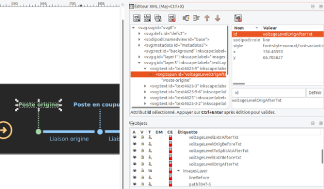

# Creating and integrating SVG illustration files

This guide explains how to create and integrate SVG illustration files for network modification dialogs. These illustrations must:

- be **translated**: their texts must be updated at load time
- be **theme-aware**: some sub-objects must be updated depending on the current theme (light/dark)

## Creating an SVG file

SVG files can be generated with many tools, but this guide uses **Inkscape** as a reference, since it is the default
drawing tool on Ubuntu and is very easy to install:

```bash
$ sudo apt install inkscape
```

## Beware of sub-object ids

Since objects are modified from code, they must be retrievable dynamically, which means they need an `id`. In Inkscape
you can rename layers, but this name is **not** what will be retrievable from JavaScript. To set a proper `id` you need
to edit the XML. This can be done manually, but also directly from within Inkscape.

Press `Ctrl+Shift+X` to open the XML editor:



At the bottom right is the list of layers. At the top right is the XML editor. Note that here you need to edit the
`tspan` tag: it is the one containing the text (e.g. "Poste origine") that will need to be replaced at load time.

The actual logic that reads these ids and replaces the texts/opacity lives in
[`components/dialogs/illustrations/generic-Illustration-network-modification.tsx`](../illustrations/generic-Illustration-network-modification.tsx).
Refer to it (and to an existing illustration file, see below) to see how ids declared in the SVG are mapped to
translation keys and consumed at runtime.

It is best to standardize the naming of ids. Examples:

- `delete-attach-line-illu-background`: id of the background image. The image is designed by default for dark mode.
  In light mode, this background element is retrieved and its opacity is set to `0`.
- `delete-attach-line-voltage-level1-left-txt`: text of the origin substation.

Note that the modification's name is usually included directly in every object's id (e.g. `delete-attach-line-...`).
This is quite verbose, but ids **must** be unique. In theory different illustrations won't be rendered on the same
page at the same time, but it's safer to keep every object id fully unique anyway.

## Text formatting

Make sure to **center** texts. This way, when they get replaced by another language's text (which may have a
different length), they will stay correctly centered.

To match the GridSuite theme, use the **Roboto** font. It would be possible to automate font replacement depending on
the theme, but this is not implemented yet.

## Saving and cleaning up the file afterwards

The file should be saved as a **plain SVG** rather than an **Inkscape SVG** (which adds a lot of extra tags that are
not useful, and even annoying, for deployment).

Even so, a few tags still need to be removed manually from the final file if present:

- the `metadata` tag
- the `xmlns` attributes on the `svg` tag

Depending on the case, it can also be worth removing the `width` and `height` attributes from the `svg` tag: this
makes the SVG have no "official" size, so it will automatically resize based on where it is inserted. This is very
useful for illustration SVGs, which should take up the full width of their container.

## Known limitations

### Multi-line text

It is possible to create multi-line, vertically centered text in Inkscape, but there is currently no known way to
read and manipulate it from React. This is mostly because the `<flowRoot>` tag is not rendered. There is likely a way
to work around this.

### Animation

It is entirely possible to animate SVGs, but this would require additional libraries (e.g. `react-spring`). One
envisioned use case is making the selected part of the diagram blink, based on what is currently selected in the UI.

## Adding a new illustration: practical checklist

To add a new illustration for a network modification dialog, you typically need to create/edit 3 files. Using
`delete-attaching-line` as a reference example:

1. **The SVG file**, placed in `src/images/network-modifications/illustrations/`:
   [`delete-attaching-line-illustration.svg`](../../../images/network-modifications/illustrations/delete-attaching-line-illustration.svg)

2. **A dedicated `*-illustration.tsx` file**, placed next to its corresponding dialog, which imports the SVG as a
   React component (via the `?react` suffix, handled by `vite-plugin-svgr`), declares the `replacedTexts` mapping
   (SVG element id ↔ translation key) and the background element id, then delegates rendering to
   `GenericIllustrationNetworkModification`:
   [`delete-attaching-line/delete-attaching-line-illustration.tsx`](./delete-attaching-line/delete-attaching-line-illustration.tsx)

3. **An import in the corresponding `*-dialog.tsx`**, used as the dialog's `subtitle`:
   [`delete-attaching-line/delete-attaching-line-dialog.tsx`](./delete-attaching-line/delete-attaching-line-dialog.tsx)

Use these three files as a template when adding a new illustration.
